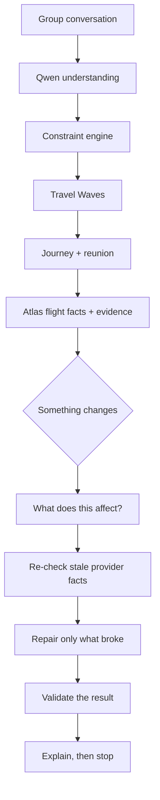

# Orkestr Travel

**The coordination agent for group journeys.**

Most travel AI helps one person build an itinerary. Orkestr coordinates a
**group** with conflicting dates, budgets and needs — and when something
changes, it repairs only the part that actually broke instead of starting the
trip over.

> **Other planners regenerate the trip. Orkestr works out what actually changed.**

Built for the **Alibaba Cloud x Atlas Agentic AI Hackathon 2026**.

---

## The problem, in one paragraph

Seven people want to go to Tokyo. Grandma can only fly Tuesday. Ryan can only
fly Wednesday and joins a week late. One person uses a wheelchair. One has a
budget they will not say out loud. Somebody's fare moves by forty dollars the
night before.

Every one of those is a *coordination* problem, not a search problem. And the
moment any of them changes, a normal planner throws the whole itinerary away and
starts again — losing every decision the group already argued their way to.

## What makes it different

**Travel Waves.** When no single flight works for everybody, Orkestr splits the
group by *confirmed availability* — deterministically, not by asking a model
what it thinks — and tracks when everyone is finally in the same place.

**Least-change repair.** Planning asks "what is the best trip?". Repair asks
"what is the smallest valid change to the trip we already have?". Those are
different questions and Orkestr answers them differently.

**It tells you what it did NOT touch.** Most planners cannot, because they
rebuilt everything and have nothing left to compare against.

**AI proposes. Code decides.** Qwen reads the messy group chat. Deterministic
code decides who flies when, what anybody can afford, and whether a repair is
valid. No model is consulted for any of that.

## The agent loop



The loop is **bounded**: a hard step limit, one place that counts steps, and no
path that reaches an ending without the count being accurate. Running out of
steps is recorded as running out of steps — never as success.

## See it in 60 seconds

```bash
npm install
npm run dev
```

Then open **`/demo/agent`** — the one screen that answers *"when the plan breaks,
does it know what to leave alone?"*

Click **Ryan joins**. Read three things: what changed, what it affected, and what
stayed exactly as it was.

No credentials needed. With nothing configured the whole demo runs from recorded
and fixture data, and says so on screen.

## What is real

| | |
|---|---|
| **Alibaba Cloud Model Studio (Qwen)** | Live-verified: structured extraction, Responses API, `web_search`, `web_extractor`, entity-bound research claims |
| **Atlas** | Live-verified: sandbox search and offer verification against the real CLI |
| **Everything consequential** | Deterministic. Money in exact minor units, constraints, waves, repair, preservation |
| **The demo** | Recorded Model Studio + recorded Atlas Sandbox + deterministic engines, so it never depends on a network |

Sandbox fares are **test data**. Nothing is booked, and there is no order,
payment or ticketing path in this application at all.

---

## What this is not

**This is an experimental travel vertical, not the Orkestr startup itself.** The
long-term startup lives in the `orkestr_luc` repository and keeps its own
validation thesis. The hackathon technologies used here are not automatically
permanent startup dependencies. See `docs/STARTUP_BOUNDARY.md`.

Saying the rest plainly saves confusion later. Orkestr Travel is **not** an
AI flight search engine, an itinerary generator, a group-chat app, an
expense-splitting app, or a travel chatbot. Those all exist. None of them answer
the question above.

The distinctive part is what happens when a group's needs **do not fit
together**: Orkestr finds the smallest split, the smallest compromise, and the
fewest questions that still make the trip work.

---

## Current status

**Phases 0 through 6 complete.**

The deterministic core decides which flight offers are feasible for whom, what
preferences they miss, and what it does not know. On top of that, the travel wave
engine groups a party into the smallest sensible set of flights, never splits
people who must travel together, and derives the earliest moment the whole group
can be in one place.

No model is involved anywhere in that, and nothing touches the network.

Phase 3 adds change. When somebody joins, leaves or changes their mind, the
system works out how far the change reaches, repairs the smallest area that needs
it, reports honestly how much of the existing plan survived, and asks only the
people whose own decisions moved. Where a plan misses somebody's preference it
proposes an explicit compromise to that person rather than deciding for them.

941 tests pass across 46 files, none of them touching a network. Lint,
typecheck and the production build are clean.

Phase 4 closes the outbound-only gap. A journey is now an ordered list of legs,
each planned independently, so a group can get home again and a future multi-city
trip needs more legs rather than a rewrite. A local flight provider models the
search and verify lifecycle, and the whole trip assembles into a structured
package of days and items.

Phase 5 adds the interface. There is now a running local application, and the
honesty rules are rendered rather than merely documented: a suggestion is not
styled like a booking, a traveller confirming they need assistance is not styled
like an airline confirming it can provide it, and no group surface carries a
private figure.

Phase 6 adds language understanding and evidence. A pasted group discussion
becomes structured proposals, each showing the words it came from, and none of
which can bind until the person it belongs to agrees. A bounded research question
produces real, citable sources with each source's authority recorded, and
community evidence is prevented **in code** from establishing an operational
fact: reviews can tell you what a visit felt like, and cannot tell you a lift
exists.

**What Phase 6 did not do: call the live service.** No Alibaba Cloud Model
Studio credential exists in this environment, so the client is written and
unit-tested against recorded response bodies and has never been executed against
Model Studio. With no key the application runs entirely offline, replays
recorded data, and labels it as recorded on every screen. Adding a key switches
it to live and changes the labels; it changes no other code.

**There is still no flight provider, no persistence and no deployment.** Nothing
here has a sign-in, and nothing ever claims a seat is available.

`docs/IMPLEMENTATION_STATUS.md` is the authoritative status table and is kept
brutally accurate. If a feature is not marked IMPLEMENTED there, it does not
work, whatever any other document seems to imply.

---

## The two ideas worth knowing

**Travel waves.** A large group does not necessarily need one flight. When no
single departure satisfies everyone's hard requirements, Orkestr splits the group
into the smallest number of coherent waves and plans a reunion, rather than
declaring the trip impossible. See `docs/TRAVEL_WAVES.md`.

**Model proposes, code decides.** Language models handle fuzzy human input and
research. They never decide whether a flight satisfies a confirmed hard
requirement. That comparison is pure deterministic code, so it is testable,
repeatable and explainable. See `docs/CONSTRAINT_ENGINE.md`.

From Phase 6 that rule is enforced rather than intended. A model may propose a
constraint and may never confirm one: the validator refuses the fields that
carry authority, the schema sent to the provider does not offer them, and the
mapper writes `origin: "MODEL_PROPOSED"` and `confirmation: "PROPOSED"` as
literals. Thirteen tests assume a prompt injection succeeded completely and
assert it changed nothing that matters.

---

## Repository layout

```
src/domain/     types and interfaces, no logic
src/core/       the deterministic engines
  time/           calendar and instant arithmetic
  money/          exact comparison, no floating point, no FX
  membership/     the membership state machine
  trip/           derived group views, SearchWindowGenerator
  constraint/     when a constraint is allowed to bind
  feasibility/    the feasibility engine and its per-constraint rules
  waves/          travel units, plan search, ranking, reunion anchor
  compromise/     relaxations, trip-scoped exceptions, candidate frontier
  decisions/      the decision inventory and the preservation figure
  repair/         impact radius and local-first plan repair
  providers/      MockFlightProvider, a local development adapter
  journey/        per-leg planning, package composition, validation
  intent/         model output -> validated -> safely mapped proposals
  research/       URL safety, source authority, claims, bounds, checks
src/adapters/     everything that touches a network. server-only
  modelStudio/      Qwen extraction, web research, shared links, prompts
  fixture/          the same pipelines over recorded data, always labelled
src/eval/       fictional evaluation cases and their scorer
evals/          opt-in live scripts. never part of the quality gate
src/ui/
  view/           view models: turn domain output into safe presentation state
  components/     presentational React, containing no business rules
  demo/           the deterministic demo scenario
app/            the Next.js application
src/fixtures/   builders for arbitrary group sizes, fictional identities only
tests/          vitest suites
docs/           specification, design and status documents
```

---

## Getting started

Requires Node 20 or newer.

```bash
npm install
npm run dev        # http://localhost:3000
```

Then open `/` and choose **Load the family demo**. The app needs no network,
no keys and no configuration; everything it shows is fixture data compiled into
the bundle. `docs/DEMO_SCRIPT.md` walks through the three-minute sequence.

`/understand` reads a pasted group discussion. `/research` runs one bounded
research question and shows every source behind it. Both work with no key,
labelled as recorded; both go live if you copy `.env.example` to `.env.local`
and add a Model Studio credential.

Quality gates:

```bash
npm run check      # lint + typecheck + tests
npm run verify     # the above, plus the production build
```

Individually:

```bash
npm run lint
npm run typecheck
npm test
```

Offline, and safe to run at any time:

```bash
npm run preflight:model-studio   # would a live call work? no network, no secret
npm run check:secrets            # also runs inside npm run verify
```

Optional, and never part of the gate above, because they call a paid external
service:

```bash
npm run smoke:model-studio   # one tiny fictional discussion
npm run eval:qwen            # 17 fictional evaluation cases
```

With no credential both report NOT CONFIGURED and **skip**, which vitest reports
as skipped rather than passed. A smoke test that quietly passes without calling
anything reports success for work that did not happen.

No environment variable is required for anything else. `.env.example` documents
every name, and "not configured" is a supported state rather than an error.

---

## Honesty rules

These are load-bearing, not decoration. The product's credibility depends on
never overstating what it knows.

| Rule | Meaning |
| --- | --- |
| External calls are off by default | A credential is a capability, not an instruction. `MODEL_STUDIO_MODE` decides |
| Unknown stays UNKNOWN | Missing data is reported as missing, never assumed to pass |
| Community opinion stays COMMUNITY SIGNAL | Reviews describe experience; they never establish an operational fact |
| Fixture stays LOCAL FIXTURE | Hand-written demo data is never labelled as live |
| Sandbox stays SANDBOX | Test-environment results are always visibly marked |
| Stale stays STALE | Old data is flagged, not quietly presented as current |
| A suggestion is never a booking | `SUGGESTED` and `BOOKED` are different states and always look different |
| A model may propose, never confirm | Enforced in three independent places, not by prompt wording |
| A citation must name a page we actually retrieved | A URL that appears only in generated prose is rejected |
| Conflicting sources stay conflicting | Both statements are shown; neither is treated as the answer |
| Provenance is per subsystem | A live model and a fixture flight list never share one label |
| Recorded is never shown as live | And there is no automatic fallback from live to recorded |

---

## Documentation

Start with `docs/PRODUCT_SPEC.md` for what the product does, and
`docs/ARCHITECTURE.md` for how it is put together.

| Document | Covers |
| --- | --- |
| `IMPLEMENTATION_STATUS.md` | What actually works today. Read this first |
| `HACKATHON_MASTER_PLAN.md` | Phase plan and judging alignment |
| `PRODUCT_SPEC.md` | Product principles and behaviour |
| `ARCHITECTURE.md` | Layers, boundaries and data flow |
| `GROUP_STATE.md` | Travellers, membership and trip events |
| `TRAVEL_WAVES.md` | The wave engine and reunion anchors |
| `CONSTRAINT_ENGINE.md` | Hard/soft/unknown and deterministic feasibility |
| `COMPROMISE_ENGINE.md` | Minimum relaxation, the frontier, and trip-scoped exceptions |
| `PLAN_REPAIR.md` | Impact radius, decisions preserved, late join and leave |
| `JOURNEY_PACKAGE.md` | The end-to-end trip package |
| `EVIDENCE_MODEL.md` | Provenance and what each source may establish |
| `SOCIAL_RESEARCH.md` | User-shared content and web research |
| `ACCESSIBILITY.md` | Assistance needs and the age-inference ban |
| `ATLAS_INTEGRATION.md` | Flight provider boundary and Atlas plan |
| `ALIBABA_CLOUD.md` | Qwen, Model Studio and agent runtime plan |
| `QWEN_INTEGRATION.md` | The Model Studio specifics: endpoints, prompts, validation, bounds |
| `PROVIDER_MODES.md` | disabled / recorded / live, and why a key alone is not permission |
| `EXTERNAL_SETUP.md` | What is configured, what is not, and how to connect it |
| `SESSION_TRANSFER.md` | The accurate handoff record. Read first with no context |
| `NEXT_CLAUDE_SESSION.md` | The startup prompt for a fresh session |
| `QODER_USAGE.md` | Recorded Qoder review stages |
| `DEMO_SCRIPT.md` | The demo scenario and narrative |
| `SUBMISSION_PACK.md` | **Submission content: title, descriptions, storyboard, narration** |
| `JUDGE_QA.md` | Hard questions from judges and investors, answered honestly |
| `JUDGING_RUBRIC_AUDIT.md` | Ruthless self-assessment against the published rubric |
| `DEPLOYMENT_PLAN.md` | **Deployment options and the Atlas hosting limitation** |
| `MANUAL_QA_CHECKLIST.md` | Browser checks for the founder to run |
| `VIDEO_RECORDING_CHECKLIST.md` | Recording setup and what to say out loud |
| `DEMO_CLAIM_MAP.md` | Every narration sentence, mapped to what backs it |
| `FAILURE_MODES.md` | What can go wrong and the intended behaviour |
| `SECURITY.md` | Secrets, privacy and sandbox safety |
| `TESTING.md` | Test strategy and required coverage |
| `STARTUP_BOUNDARY.md` | Startup versus hackathon separation, and what gets ported back |
